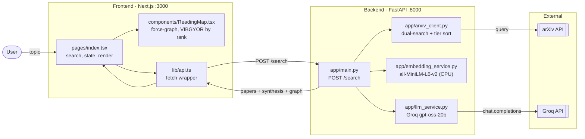
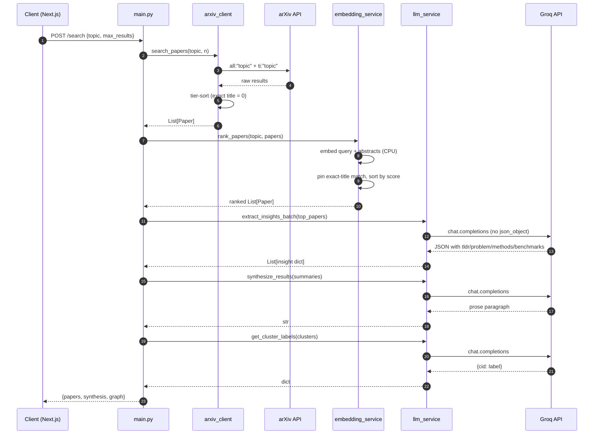
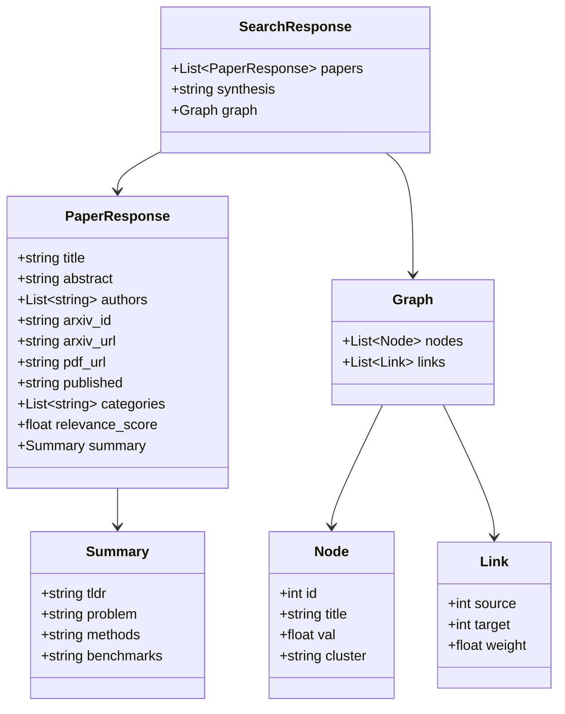
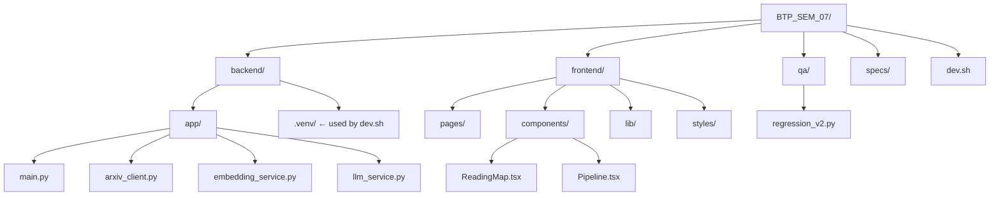

# Project Report — AI Research Copilot (BTP_SEM_07)

## 1. Overview
The AI Research Copilot is a full-stack application designed to help researchers discover and synthesize information from arXiv papers. It uses a Next.js 16 frontend (Pages router) and a FastAPI backend. The application retrieves papers based on a topic, reranks them using a local MiniLM embedding model (CPU-only), extracts structured insights and synthesis via the Groq API (gpt-oss-20b), and visualizes the research landscape as a force-directed graph with VIBGYOR color-coding by relevance rank.

## 2. End-to-End Flow



The user enters a topic in `pages/index.tsx`, which triggers a search via `lib/api.ts`. The FastAPI `main.py:search` handler orchestrates the pipeline: it first retrieves candidates via `arxiv_client.search_papers`, reranks them semantically via `embedding_service.rank_papers`, extracts insights and synthesis via `llm_service`, and finally generates a graph before returning the response to the frontend.

## 3. Backend Request Pipeline



1. **Candidate Retrieval:** Implemented by `search_papers` in `backend/app/arxiv_client.py:37`. It returns a `List[Paper]` retrieved from the arXiv API via a dual-search strategy.
2. **Semantic Ranking:** Implemented by `rank_papers` in `backend/app/embedding_service.py:42`. It returns a sorted `List[Paper]` based on cosine similarity of abstracts, while pinning exact title matches to the top.
3. **Insight Extraction:** Implemented by `extract_insights_batch` in `backend/app/llm_service.py:58`. It returns a `List[dict]` of structured insights. Invariant: it must NOT use `response_format=json_object` due to model failures on Groq (see `llm_service.py:71`).
4. **Synthesis:** Implemented by `synthesize_results` in `backend/app/llm_service.py:133`. It returns a `str` combining findings across papers.
5. **Cluster Labeling:** Implemented by `get_cluster_labels` in `backend/app/llm_service.py:164`. It returns a `dict` mapping cluster IDs to descriptive theme labels.

## 4. Data Contracts



**Backend Models (`main.py`):**
- `PaperResponse`: `title` (str), `abstract` (str), `authors` (List[str]), `arxiv_id` (str), `arxiv_url` (str), `pdf_url` (str), `published` (str), `categories` (List[str]), `relevance_score` (float | None), `summary` (Dict[str, Any] | None).
- `Graph Node`: `id` (int), `title` (str), `val` (float), `cluster` (str).
- `Graph Link`: `source` (int), `target` (int), `weight` (float).

**Frontend Consumption (`frontend/lib/api.ts`):**
The frontend consumes the `SearchResponse` shape defined in the backend. 

**Cross-check:**
No mismatches found. The frontend `Paper` type in `api.ts` aligns with the backend `PaperResponse`.

## 5. Repo Topology



- `backend/`: FastAPI server logic and data processing.
- `frontend/`: Next.js user interface.
- `qa/`: API regression tests.
- `specs/`: Project specifications and architectural docs.
- `.`: Root containing dev scripts and global config.

## 6. External Dependencies

**Backend (`backend/requirements.txt`):**
- `fastapi`: HTTP server.
- `uvicorn`: ASGI server for FastAPI.
- `arxiv`: Python wrapper for arXiv API.
- `sentence-transformers`: Local MiniLM embeddings.
- `numpy`: Numerical operations for embeddings.
- `requests`: HTTP client for API calls.
- `python-dotenv`: Environment variable loading.
- `pydantic`: Data validation and settings management.

**Frontend (`frontend/package.json`):**
- `next`: Framework for routing and rendering.
- `react` / `react-dom`: UI library.
- `react-force-graph-2d`: D3-based graph visualization.
- `tailwindcss` / `autoprefixer` / `postcss`: CSS framework.
- `lucide-react`: UI icons.
- `clsx` / `tailwind-merge`: Tailwind utility helpers.

---

## 7. Environment Variables

- `GROQ_API_KEY`: Required. Used in `backend/app/llm_service.py:23` for Groq API authentication.
- `GROQ_MODEL`: Optional. Default: `openai/gpt-oss-20b`. Used in `backend/app/llm_service.py:24`.
- `.env` exists in `backend/` and is listed in `.gitignore`.

---

## 8. Dev / Run

The `dev.sh` script automates the environment startup:
1. Starts the backend server using the specific interpreter path `./backend/.venv/bin/python` running `uvicorn backend.app.main:app` with `--reload` on port 8000.
2. Launches the frontend using `npx next dev --webpack` on port 3000.
3. Uses a `trap` to ensure the backend process is killed when the frontend dev server is stopped.

---

## 9. Known Landmines

- **LLM JSON Stability:** `extract_insights_batch` and `get_cluster_labels` in `llm_service.py` MUST NOT use `response_format=json_object` because the reasoning model often fails to provide content in strict mode. Manual parsing with markdown-fence stripping is required.
- **Polymorphic Summaries:** `Paper.summary` can be a `str` (raw) or a `dict` (structured). `llm_service._extract_tldr` handles this polymorphism.
- **CPU-Only Embeddings:** `embedding_service.py` MUST force `device="cpu"` to avoid Metal (MPS) race conditions on Apple Silicon that crash the server.
- **Python Environments:** `dev.sh` relies on `backend/.venv`, which is distinct from any root venv.

---

## 10. Test Coverage

**`qa/regression_v2.py` summary:**
- **Total Tests:** 18
- **Categories:**
  - **Validation:** Input checks (missing/empty topic, max_results limits).
  - **CORS:** Origin validation and preflight OPTIONS checks.
  - **Functional:** Graceful handling of diverse queries and invariant checks on the graph payload.
  - **Load:** Concurrency tests for mixed valid/invalid requests.
- **Gaps:** No unit tests for embedding math; no frontend E2E tests.

---

## 11. Appendix — Raw Verification Output

```bash
# ls -la
total 64
drwxr-xr-x@ 17 shreyaskumarrai  staff   544 19 Sep 23:01 .
drwx------@ 33 shreyaskumarrai  staff  1056 19 Sep 23:00 ..
-rw-r--r--@  1 shreyaskumarrai  staff    77 19 Sep 09:42 .env
-rw-r--r--@  1 shreyaskumarrai  staff     303 19 Sep 09:39 .env.example
drwxr-xr-x  15 shreyaskumarrai  staff   480 19 Sep 23:20 .git
-rw-r--r--   1 shreyaskumarrai  staff     420 19 Sep 23:02 .gitignore
drwxr-xr-x@  7 shreyaskumarrai  staff     224 19 Sep 10:11 .venv
drwxr-xr-x@  7 shreyaskumarrai  staff     224 19 Sep 23:01 backend
-rwxr-xr-x   1 shreyaskumarrai  staff     277 19 Sep 20:17 dev.sh
drwxr-xr-x@ 16 shreyaskumarrai  staff   512 19 Sep 23:01 frontend
drwxr-xr-x@  3 shreyaskumarrai  staff      96 19 Sep 14:18 qa
-rw-r--r--@  1 shreyaskumarrai  staff     631 19 Sep 13:17 README.md
drwxr-xr-x   3 shreyaskumarrai  staff      96 19 Sep 21:31 specs
-rw-r--r--@  1 shreyaskumarrai  staff     739 19 Sep 13:23 test_arxiv_client.py
-rw-r--r--@  1 shreyaskumarrai  staff     744 19 Sep 13:23 test_llm_service.py
drwxr-xr-x@  8 shreyaskumarrai  staff     256 19 Sep 13:23 venv
-rw-r--r--@  1 shreyaskumarrai  staff     541 19 Sep 13:36 verify_groq.py

# ls backend/app/
__init__.py
__pycache__
arxiv_client.py
embedding_service.py
llm_service.py
main.py
verify_groq.py

# ls frontend/components/ frontend/pages/ frontend/lib/
frontend/components/:
Pipeline.tsx
ReadingMap.tsx
frontend/lib/:
api.ts
frontend/pages/:
_app.tsx
index.tsx
index.tsx.bak
regression_v2.py

# ls qa/
regression_v2.py

# cat dev.sh
#!/usr/bin/env bash
set -e
cd "$(dirname "$0")"

./backend/.venv/bin/python -m uvicorn backend.app.main:app \
  --host 0.0.0.0 --port 8000 --reload --reload-dir backend/app &

BACKEND_PID=$!
trap "kill $BACKEND_PID 2>/dev/null || true" EXIT

cd frontend
npx next dev --webpack

# cat .env.example
# Research Agent - environment variables
# Copy to .env and fill in your values

# PostgreSQL connection
DB_USER=postgres
DB_PASSWORD=

# Ollama (optional - uses localhost:11434 by default)
# OLLAMA_BASE_URL=http://localhost:11434

# HuggingFace token (optional - speeds up model downloads)
# HF_TOKEN=

# git log --oneline -10
3b60045 chore: proper .gitignore; untrack venvs, node_modules, build artifacts
d3d928e chore(graph): remove diagnostic console.log after isolated-node fix verified
165a0ac chore: stop tracking uvicorn.log
51f7e1c fix(llm): drop json_object mode in extract_insights_batch; fence-strip + traceback
a0da589 fix(llm): handle both str and dict Paper.summary in synthesize_results
8613375 fix(search): canonical paper ranks #1 for exact-title query
b857d30 checkpoint: pre-VIBGYOR rework
6bebae0 feat(graph+search): VIBGYOR colors by rank, non-overlap layout, canonical-paper ranking
cd31544 checkpoint: colors + legend working; graph visuals and ranking next
17551f3 chore(frontend): Tailwind v4 rendering; webpack dev script

# git tag --list | sort
graph-and-search
graph-and-search-v2
llm-content-verified
post-ui-polish
pre-graph-rework
pre-ui-polish
regression-18
tailwind-live
ui-polish-partial
```
